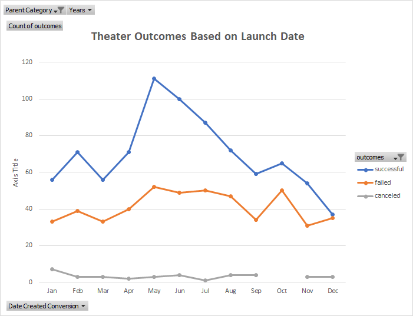
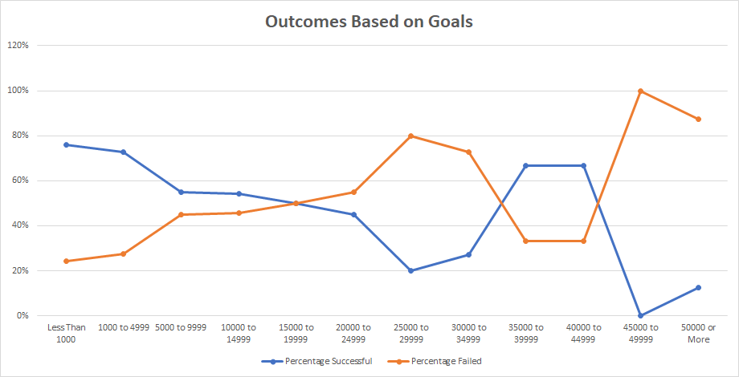

# Kickstarting with Excel

## Overview of Project

### Purpose
Louise wanted to start a crowdfunding campaign to help fund her play, *Fever*. She estimated a budget of over $10,000 and was uncertain about embarking in her first fundraising campaign. We analyzed statistics for kickstarters in the plays and theater categories and found that there were more campaigns that were successful. After the analysis was conducted, Louise started her campaign and came close to her fundraising goal. Now, she wants us to analyze how different campaigns performed in relation to their launch dates and their funding goals.
## Analysis and Challenges

### Analysis of Outcomes Based on Launch Date

When analyzing Theater Outcomes by Launch Date, a pivot chart and line graph was created to filter the information by the year launched and the parent category, theater. Date created by months was established as rows and the outcomes were filtered by successful, failed, and canceled campaigns. When looking at the line graph, every month had more successes than failures, but the winter months did not peak.
### Analysis of Outcomes Based on Goals

When analyzing Outcomes Based on Goals, I used the data from the kickstarter tab to make a table with goal ranges and made different criteria in the COUNTIF formula to dissect the information needed for number of outcomes and percentages of outcomes. The first part of my formula is specifying where the information need to be pulled from, in this case it was the goals column. Then, place a criterion for the range given for each goal and after place a criterion to choose from the range, which ones were successful, failed, or canceled. I was able to calculate the percentages of successful and failed plays within the goal range from the number of outcomes divided by the total projects. After, I created a line graph to depict the pattern between successful and failed projects according to their goal.
### Challenges and Difficulties Encountered
A challenge that I encountered, was building the chart for Outcomes Based on Goals. First, I applied filters to the kickstarter tab for all successful plays and created a COUNTIF formula to retrieve information for the outcomes based on the goal range. After moving on to the failed column, I noticed that even though I was filtering the failed plays in the kickstarter column, the numbers were the same as the successful column. I then realized that it was pulling all the data even though it was filtered in the kickstarted worksheet when I input the formula. After noticing this, I built my COUNTIF formula to have different criteria for each as goal range, outcome, and subcategory to get the correct values. 
## Results

Two conclusions I can draw about the Outcomes based on Launch Date are the following:

-Campaigns were more successful when launched during the summer months.

-December was the only month where the success rate and the failed rate were almost identical but overall, when looking at the total of 1369 campaigns 61% of those were successful.

A conclusion about the Outcomes based on Goals graph is the following:

-Goals under $15,000 were successful.

A limitation that I encountered when analyzing the data was the different currencies. When creating the Outcomes Based on Goals, if they met their goal, it was successful. But when grouping into different goal ranges, is it accurate when we have different currencies? In the future, I would make sure the goals are in the same currency to better group goal ranges with the correct values.

Another table I recommend is one to reflect the amount of time each kickstarter was open for. You can do a pivot chart based on how long it took to reach the goal based on months. This will help future kickstarters plan how many months it will take and if they are meeting their goal each month.
